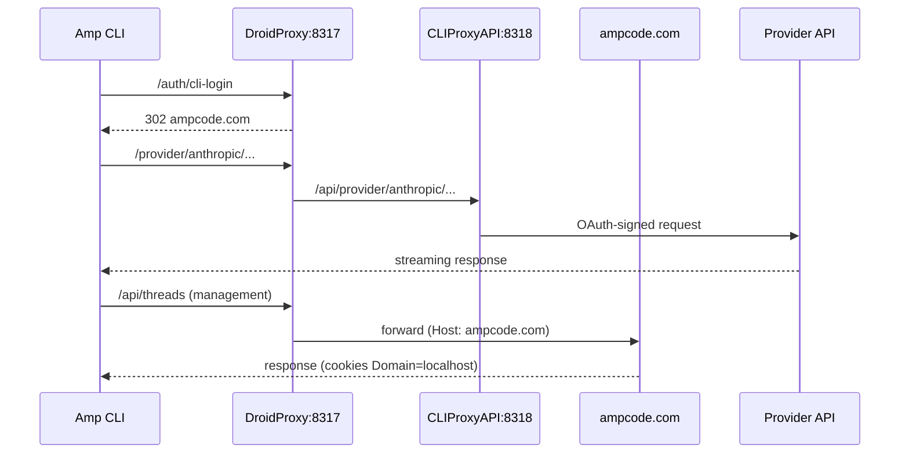

# Amp CLI Setup Guide

This guide explains how to configure [Amp CLI](https://ampcode.com/manual)
to route through DroidProxy so it can use your Claude Max, ChatGPT Plus,
and Gemini subscriptions in place of Amp credits.

## Overview

DroidProxy integrates with Amp CLI by:

- Redirecting Amp CLI login directly to `ampcode.com` (preserves OAuth
  cookies, rewritten to `Domain=localhost` on the way back).
- Rewriting `/provider/*` model traffic onto CLIProxyAPIPlus, which signs
  requests with your local OAuth tokens.
- Forwarding everything else (threads, user, team APIs) through to
  `ampcode.com` transparently.

There is **no fallback to Amp credits** -- if the provider the model
belongs to is not authenticated, Amp gets an `auth_unavailable` error.



## Prerequisites

- DroidProxy running (`droidproxy` or `droidproxy daemon`). Confirm with
  `droidproxy doctor` that ports 8316 / 8317 / 8318 are healthy.
- Amp CLI installed (`amp --version`).
- At least one active subscription (Claude Max/Pro, ChatGPT Plus/Pro, or
  Gemini).

## Setup

### 1. Point Amp at DroidProxy

```bash
mkdir -p ~/.config/amp
echo '{"amp.url": "http://localhost:8317"}' > ~/.config/amp/settings.json
```

### 2. Authenticate your providers

The web UI is the simplest path. Open <http://127.0.0.1:8316/> and click
**Connect** next to each provider you want to use. OAuth opens in your
system browser; tokens are written under `~/.cli-proxy-api/`.

On a headless host (SSH, no `$DISPLAY`), use the CLI flags instead:

```bash
# Claude (Anthropic) -- uses your Claude Max/Pro subscription
~/.local/share/droidproxy/bin/cli-proxy-api-plus \
  -config ~/.cli-proxy-api/merged-config.yaml \
  -claude-login

# ChatGPT (OpenAI) -- uses your ChatGPT Plus/Pro subscription
~/.local/share/droidproxy/bin/cli-proxy-api-plus \
  -config ~/.cli-proxy-api/merged-config.yaml \
  -codex-login

# Gemini (Google) -- uses your Google AI subscription
~/.local/share/droidproxy/bin/cli-proxy-api-plus \
  -config ~/.cli-proxy-api/merged-config.yaml \
  -login
```

Binary location by install method:

| Install method | `cli-proxy-api-plus` path |
|---|---|
| AppImage / pipx / source | `~/.local/share/droidproxy/bin/cli-proxy-api-plus` |
| AUR (`droidproxy-linux`) | `/usr/lib/droidproxy/cli-proxy-api-plus` |
| AUR (`droidproxy-linux-bin`) | mounted inside the AppImage -- use `droidproxy paths` to confirm |

`droidproxy paths` prints the resolved binary path for your install.

### 3. Optional: log into Amp itself

If you want the Amp management features (threads, team, billing views):

```bash
amp login
```

Your browser opens to `ampcode.com`. DroidProxy rewrites the callback so
the session cookie is stored for `localhost`.

### 4. Restart DroidProxy

```bash
systemctl --user restart droidproxy.service     # or kill + relaunch
```

### 5. Smoke test

```bash
amp "Say hello"
```

## Provider Priority

When multiple providers are authenticated, Amp may select a model from
any of them. The DroidProxy settings UI has an **Enable / Disable**
toggle per provider:

- **Enabled** (default) -- the provider's models are available to Amp.
- **Disabled** -- the provider's models are excluded via
  `oauth-excluded-models` in `~/.cli-proxy-api/merged-config.yaml`.

Changes hot-reload inside `cli-proxy-api-plus` -- no restart required.

Use cases:

- **Single-provider mode** -- disable all but one provider so Amp always
  picks the same one.
- **Route around rate limits** -- temporarily disable a provider you've
  exhausted.
- **A/B comparison** -- flip providers on and off between `amp` runs.

> **Note:** the Amp toggles only cover the three OAuth providers
> (Claude / Codex / Gemini). The direct-API providers added in 1.8.15
> (Synthetic, Kimi Code, Fireworks Fire Pass) bypass CLIProxyAPIPlus
> entirely and are not reachable through Amp.

## Troubleshooting

### `auth_unavailable: no auth available`

You have not authenticated the provider for the model Amp is trying to
use. Run the matching login command from step 2 (or click **Connect** in
the web UI), then restart DroidProxy.

### OAuth token expired

```bash
# Inspect token files
ls -la ~/.cli-proxy-api/*.json

# Re-auth (Claude example)
~/.local/share/droidproxy/bin/cli-proxy-api-plus \
  -config ~/.cli-proxy-api/merged-config.yaml \
  -claude-login
```

### Browser login fails

`amp login` relies on DroidProxy being reachable on `127.0.0.1:8317`.
Run `droidproxy doctor` first -- it flags blocked ports, missing
`cli-proxy-api-plus` binary, GTK availability, and `cloudflared`.

### 502 from Amp CLI

Usually `cli-proxy-api-plus` is not running. Check `droidproxy doctor`
and `systemctl --user status droidproxy.service` (or the tray icon).

## Benefits

- **Use your subscriptions** -- Claude Max, ChatGPT Plus, and Gemini work
  through Amp with no API-key billing.
- **No surprise charges** -- there is no fallback to Amp credits.
- **Full transparency** -- Amp errors out loudly if the provider isn't
  authenticated.
- **One proxy for everything** -- DroidProxy serves Factory Droids and
  Amp CLI simultaneously.

## See also

- [`SETUP.md`](SETUP.md) -- Factory Droid configuration.
- [Amp CLI documentation](https://ampcode.com/manual).
